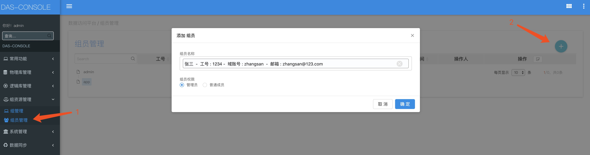
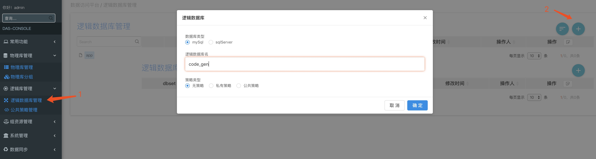

#### 如果您还未安装das-console 请参考(安装启动)

## 一、创建项目组

&nbsp;&nbsp;&nbsp;&nbsp; 1、刚安装登录进入das-console时是没有数据的，需要新建项目组，如图所示，选择组管理，然后点击右上角的按钮，添加组

## 二、给项目组添加人员

&nbsp;&nbsp;&nbsp;&nbsp; 2、给项目组添加开发人员，在das-console页面的左侧导航栏点击‘组资源管理’->'组员管理', 点击右侧页面右上角加号按钮，如图所示

## 三、添加物理库

&nbsp;&nbsp;&nbsp;&nbsp; 1、新物理库，在das-console页面的左侧导航栏点击'物理库管理'->'物理库管理', 点击右侧页面右上角加号按钮，在'物理库管理'也可以对物理库进行增删改的操作，如图所示

## 四、新建逻辑库

&nbsp;&nbsp;&nbsp;&nbsp; 1、在das-console页面的左侧导航栏点击‘物理库管理’->'逻辑库库管理'，在'逻辑库库管理'页可以对项目进行增删改的操作，如图所示 `提示`私有策略，和公共策略请 查看详细说明

&nbsp;&nbsp;&nbsp;&nbsp; 2、给逻辑库添加逻辑库映射 `提示`参数使用请查看详细说明

## 五、创建项目

&nbsp;&nbsp;&nbsp;&nbsp; 1、新建项目，在das-console页面的左侧导航栏点击‘常用功能’->'项目管理', 点击右侧页面右上角加号按钮，在'项目管理'也可以对项目进行增删改的操作，如图所示

## 六、下载das-client所需的项目配置文件

&nbsp;&nbsp;&nbsp;&nbsp; 1、项目管理页，点击下载按钮，如图所示，`提示`配置文件的使用请查看详细说明

