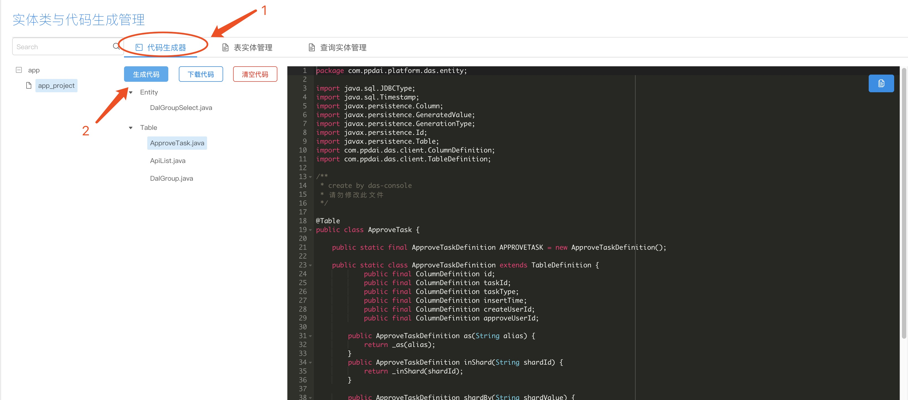

#### 如果您还未安装das-console 请参考(安装启动)

## 一、创建表实体

&nbsp;&nbsp;&nbsp;&nbsp; 1、在das-console页面的左侧导航栏点击'常用功能'->'代码生成器', 点击'表实体管理'tab页，如果没有任何实体类会提醒新建，如图

## 二、创建查询实体

&nbsp;&nbsp;&nbsp;&nbsp; 2、在das-console页面的左侧导航栏点击'常用功能'->'代码生成器', 点击'查询实体管理'tab页, 点击右侧页面右上角加号按钮，如图所示

## 四、生成代码

&nbsp;&nbsp;&nbsp;&nbsp; 1、、在das-console页面的左侧导航栏点击'常用功能'->'代码生成器', 点击'代码生成器'tab页，点击'生成代码'按钮，如图所示

### 五、复制代码 

&nbsp;&nbsp;&nbsp;&nbsp; 在'代码生成器'页，点击右上角的复制代码按钮可以复制代码

### 六、下载代码 

&nbsp;&nbsp;&nbsp;&nbsp;  在'代码生成器'页，点击'下载代码'按钮可以下载当前项目生成的代码

### 七、清空代码 

&nbsp;&nbsp;&nbsp;&nbsp; 在'代码生成器'页，点击'清空代码'按钮可以清空当前项目生成的代码

