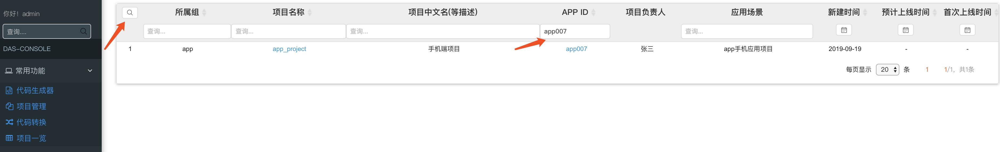

## 一、新增组

&nbsp;&nbsp;&nbsp;&nbsp; 1、在das-console页面的左侧导航栏点击"组资源管理" -> "组管理"，新建组可以点击添加组按钮，如果所示。

&nbsp;&nbsp;&nbsp;&nbsp; 2、在"组管理"页，可以对组信息进行修改。

## 二、组添加组员

&nbsp;&nbsp;&nbsp;&nbsp; 1、在das-console页面的左侧导航栏点击"组资源管理" -> "组员管理"，新建组可以点击添加组按钮，如果所示。

&nbsp;&nbsp;&nbsp;&nbsp; 2、同一用户可以加入多个组。

## 三、管理页查询功能

&nbsp;&nbsp;&nbsp;&nbsp; 1、'项目管理'页查询，在'项目管理'页可以点击操作旁边的按钮展开查询条件,进行查询。如图所示

&nbsp;&nbsp;&nbsp;&nbsp; 2、'项目一览'页查询，在'项目一览'页可以点击查询按钮展开查询条件,进行查询。如图所示

&nbsp;&nbsp;&nbsp;&nbsp; 3、'物理库管理'页查询，在'物理库管理'页可以点击操作旁边的按钮展开查询条件,进行查询。如图所示

&nbsp;&nbsp;&nbsp;&nbsp; 4、'逻辑库库管理'页查询，在'逻辑库库管理'页可以点击操作旁边的按钮展开查询条件,进行查询。如图所示

