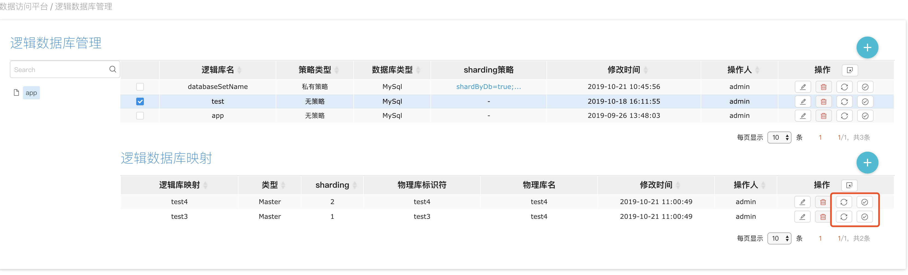

#### 在实际开发和使用时，我们如果需要引入配置中心，das-client从配置中心获取配置信息，需要在das-client和das-console分别接入对配置中心的读写操作的接口

#### 以下内容将详细说明每个页面按钮和对应的接口实现

## 1、在逻辑库映射管理页,实现增、删、改接口

&nbsp;&nbsp;&nbsp;&nbsp; 1、在增、删、改、同步逻辑库映射信息到数据中心，可以实现"ConfigProvider"的四个接口方法。

方法名 | 作用 | 说明 
 :-:| :-: | :-: |
addDatabaseSetEntries | 批量添加逻辑库映射 | 参数为逻辑库映射信息list
updateDatabaseSetEntry | 更新逻辑库映射信息| 参数为逻辑库映射信息
deleteDatabaseSetEntry | 删除逻辑库映射 | 参数为逻辑库映射信息
getDatabaseSetEntry | 获取逻辑库映射信息 | 参数为逻辑库映射名，具有唯一性

## 2、逻辑库映射数据同步到配置中心

&nbsp;&nbsp;&nbsp;&nbsp; 1、如果配置中心与DAS数据不统一，这时可以使用同步按钮同步逻辑库映射数据到配置中心，如图所示

&nbsp;&nbsp;&nbsp;&nbsp; 2、好了，这个时候点击同步按钮，就可以再次把逻辑库映射信息同步到配置中心了

## 3、数据校验
&nbsp;&nbsp;&nbsp;&nbsp; 1、查看配置中心和DAS数据是否一致，这个时候需要和DAS的数据进行比较，如果比较发现数据有差异，可以点击同步按钮恢复数据中心的逻辑库映射信息的配置。如图所示

&nbsp;&nbsp;&nbsp;&nbsp; 2、首先需要实现"ConfigProvider"的"getDatabaseSetEntry"接口方法，此方法有一个参数（逻辑库映射名，具有唯一性）返回逻辑库映射信息，点击'校验按钮'会调用此方法。如图所示

&nbsp;&nbsp;&nbsp;&nbsp; 3、好了，如果数据有差异，可以点击同步按钮同步配置到配置中心

 

